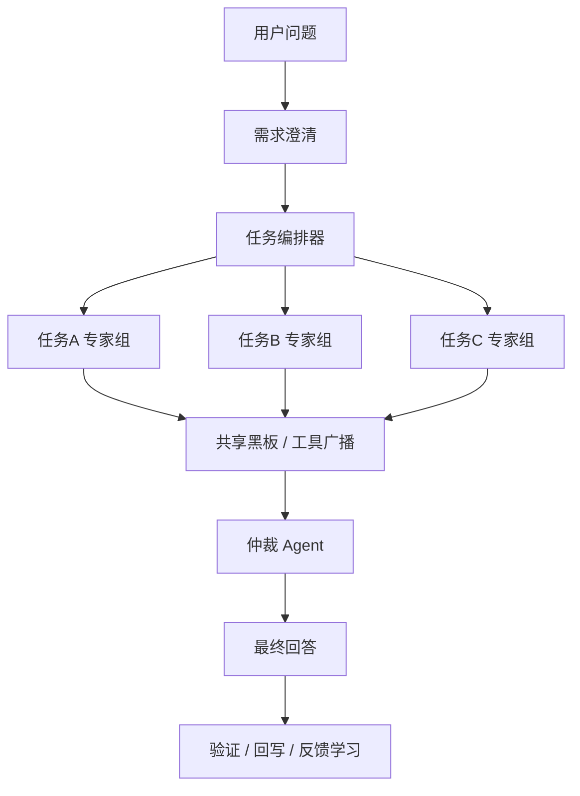

# 多智能对话终态设计稿

> 目标：把当前“路由 + 专家分析 + 交叉审阅 + 结果回写”的分散链路，升级为统一的“需求澄清 → 任务拆解 → 并发专家 → 共享黑板/记忆 → 仲裁总结 → 验证回写”闭环。

**范围**：`backend/agent/*`、`backend/services/conversation/*`、`backend/routers/conversation/*`、`backend/db/agents.py`、`backend/agent/eval/*`

---

## 1. 目标

### 1.1 用户看到的终态

用户发起一个复杂投资问题后，系统应当：

1. 先判断是否需要澄清。
2. 自动拆成多个子任务。
3. 并发派给多个 specialist。
4. 所有 agent 共享同一份证据和上下文。
5. 由仲裁 agent 汇总分歧并给出最终建议。
6. 最终结果和证据回写，后续可验证、可复盘、可学习。

### 1.2 设计原则

- 不让专家重复查同一份数据。
- 不让最终回答“像拼接”，必须统一口径。
- 不让硬编码决定一切，路由和职责尽量配置化。
- 不让回答脱离验证，所有建议都能追踪到结果。

---

## 2. 现状问题

当前系统已经有这些能力：

- `orchestrator.py` 有编排、SOP、检查点、仲裁、回写。
- `multi_agent.py` 有专家执行、交叉审阅、工具调用。
- `blackboard.py` 有共享黑板。
- `conversation_context.py` 有对话上下文聚合。
- `alert_scanner.py`、`event_radar.py`、`opportunity_engine.py` 已经有“预警/机会/验证”零件。

但它们的问题是：

- 任务拆解和专家分派仍偏硬编码。
- 共享数据有，但还不够统一。
- 仲裁有，但还不够像“最后裁决者”。
- 验证和回写是分散的，不是同一条链路。

---

## 3. 总体架构



### 3.1 分层

- `Clarifier`：判断问题是否清晰，必要时追问。
- `Planner`：把问题拆成任务图，决定哪些 agent 参与。
- `Executor`：并发执行每个任务波次。
- `Blackboard`：共享事实、工具结果、关键结论。
- `Arbiter`：综合分歧，输出最终结论。
- `Verifier`：把结果送入建议验证、复盘、反馈学习。

---

## 4. 关键行为

### 4.1 需求澄清

当问题含糊、缺少标的、缺少目标、缺少约束时，先返回澄清问题，而不是直接分析。

澄清结果应写入 checkpoint，支持后续续答。

### 4.2 任务拆解

Planner 输出结构化任务图：

```json
{
  "complexity": "simple|medium|complex",
  "question_type": "attribution|prediction|action|comparison|generic",
  "refined_query": "...",
  "tasks": [
    {
      "task_id": "t1",
      "objective": "估值判断",
      "agents": ["valuation_expert"],
      "depends_on": [],
      "priority": "high",
      "required_data": ["估值", "分位", "日期"]
    }
  ],
  "arbitration_mode": "always|if_conflict|if_complex",
  "shared_evidence_keys": ["portfolio", "valuation", "news", "memory"]
}
```

### 4.3 并发执行

同一波次的任务并发执行，执行前统一注入：

- 用户画像
- 持仓/关注列表
- 最近决策
- 已有工具结果
- 黑板摘要

执行后统一写回黑板，再进入下一波。

### 4.4 仲裁总结

仲裁 agent 只做三件事：

1. 识别分歧。
2. 选择最终倾向。
3. 给出可执行建议和风险边界。

仲裁 agent 不能假装自己查过没有查过的数据。

### 4.5 验证回写

最终建议进入现有验证体系：

- 建议候选
- 到期验证
- 准确率统计
- 用户反馈学习

这样形成“建议 → 执行 → 验证 → 学习”的闭环。

### 4.6 Prompt 与职责配置化

所有 agent 的系统提示词和能力边界必须从硬编码中退出，统一以 `analysis_agents` 表和少量声明式配置为准。

原则：

- `db/agents.py` 只负责加载和运行时拼装，不再堆满长 prompt。
- `router_config.yaml` 只保留粗路由和兜底规则。
- 新增/调整 agent 职责时，优先改表，不优先改代码。

---

## 5. 共享数据层

### 5.1 四层上下文

- `L0` 长期记忆：用户偏好、风险画像、历史反馈。
- `L1` 会话事实：当前持仓、关注列表、最近决策。
- `L2` 任务证据：工具结果、黑板条目、专家结论。
- `L3` 仲裁结果：最终判断、分歧解释、未覆盖盲点。

### 5.2 共享规则

- 原始工具结果只写一次，后续专家复用。
- 证据必须带时间戳和来源。
- 冲突时优先最新、优先工具原文、优先可验证数据。
- 没有数据就明确说“暂无该数据”，不能补猜。

---

## 6. 角色边界

### 6.1 Orchestrator

负责编排，不负责装专家结论。

### 6.2 Specialist

只做单点分析，输出结构化结论和证据，不直接输出总裁定。

### 6.3 Arbiter

负责综合判断，必要时否决过度冒进的建议。

### 6.4 Memory

负责长期偏好、行为反馈、实体属性变化的沉淀。

---

## 7. 需要调整的文件

### 新增

- `backend/agent/core/task_planner.py`
- `backend/agent/core/arbitration.py`

### 修改

- `backend/agent/core/router.py`
- `backend/agent/core/orchestrator.py`
- `backend/agent/core/multi_agent.py`
- `backend/agent/infra/blackboard.py`
- `backend/services/conversation/conversation_context.py`
- `backend/routers/conversation/conversations.py`
- `backend/db/agents.py`
- `backend/agent/router_config.yaml`
- `backend/agent/memory/memory.py`
- `backend/agent/memory/feedback_learner.py`
- `backend/agent/eval/conversation_evaluator.py`
- `backend/services/quality/decision_accuracy.py`

### 测试

- `backend/tests/test_conversation_execution_state.py`
- `backend/tests/test_router_complexity.py`
- `backend/tests/test_multi_agent_optimizer.py`
- `backend/tests/test_decision_full_loop.py`
- 新增 `backend/tests/test_task_planner.py`
- 新增 `backend/tests/test_arbitration_flow.py`

---

## 8. 验收标准

- 复杂问题会先澄清，再拆任务。
- 多个 agent 会并发执行，而不是串行重复查数。
- 所有 agent 共享同一份黑板证据。
- 最终回答由仲裁 agent 统一口径。
- 回答后能落到验证、统计和反馈学习。
- 任何一轮都不能编造未查到的数据。

---

## 9. 风险与约束

- 并发会增加 LLM 成本，需要有上限和任务分组。
- 黑板过长会稀释重点，需要有截断和优先级。
- 仲裁过强会压掉专家差异，需要保留分歧说明。
- 过度自动化会误判澄清时机，需要保留人工继续问答入口。
